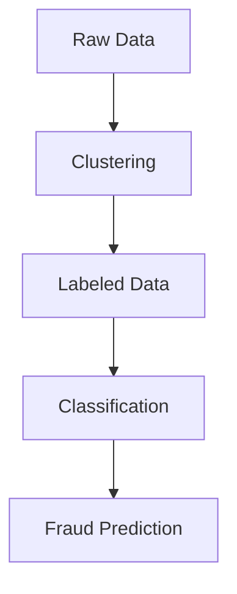

# Bank Fraud Detection: Hybrid Clustering & Classification

Foto oleh Towfiqu barbhuiya di [Unsplash](https://unsplash.com/id/foto/orang-yang-memegang-perangkat-elektronik-hitam-putih-HNPrWOH2Z8U?utm_content=creditCopyText&utm_medium=referral&utm_source=unsplash)
      

## Overview

Proyek ini mengembangkan sistem deteksi transaksi mencurigakan dengan menggabungkan **unsupervised clustering** dan **supervised classification** pada dataset transaksi bank.

## Tujuan
1. Mengidentifikasi pola transaksi mencurigakan melalui clustering
2. Membangun model klasifikasi untuk prediksi fraud

## Metodologi
- Dataset: 2500+ transaksi bank
- Unsupervised learning dengan Clustering: K-Means
- Supervised Learning dengan Classification: Decision Tree, Logistic Regression, dan Random Forest

## Evaluasi Model

### Evaluasi Model Clustering
| Stage | Silhouette Score | Optimal K | Key Features |
|-----------|------------------|-----------|-----------|
| Sebelum Feature Selection   | 0.4454             | 3         | 	All features |
| Setelah Feature Selection    | 0.7152             | 6         | 5 selected features |

### Evaluasi Model Classification
Semua model mencapai akurasi dan F1-score 100%. Terdeteksi adanya overfitting

Kemungkinan Penyebab Utama:
1. Pemilihan fitur yang tidak tepat
2. Model yang terlalu kompleks
3. Potensi kebocoran data

## Insight Utama
Kesimpulan Cluster:
1. Cluster 0 & 1

Kategori: Akun Normal

Karakteristik: Transaksi rutin dengan besaran kecil-sedang, frekuensi stabil, dan pola penggunaan konsisten

Kesimpulan: Tidak ada indikasi transaksi mencurigakan yang kuat.

2. Cluster 2 & 3

Kategori: Akun Aktif

Karakteristik: Jumlah transaksi tinggi, variasi lokasi/IP terbatas, dan dominan channel Mobile Banking

Kesimpulan: Kemungkinan pengguna bisnis, perlu monitoring.

3. Cluster 4 & 5

Kategori: High-Risk Fraud

Karakteristik: Transaksi besar dan frekuensi tinggi, alamat IP bervariasi (multi-country), dan multi-perangkat dengan channel Online, waktu transaksi tidak wajar (seperti 02.00-05.00), dan banyak percobaan login gagal sebelum transaksi

Kesimpulan: Berpotensi tinggi sebagai akun mencurigakan atau penipuan.

## Future Works
1. Menganalisis potensi kebocoran data saat klasifikasi
2. Analisis pemilihan fitur dengan cara berbeda
3. Menggunakan model clustering dan classification lain
